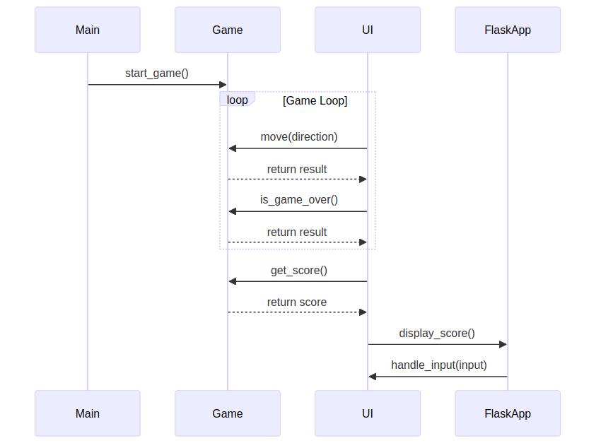

本次博客内容包括：

- 大语言模型介绍
- 各方案深度评测
- 当前自动编程阶段

题设中，「我们」指有意于从事计算机相关行业的大学生，因此我会更多地考虑经费，同时考虑自动编程方案在大学生实际课业中的应用场景。

为了让评分更有艺术感，我给 4 个等级取了中文名，分别是：观者、战士、猎人、鸡煲。希望若读者在下文中看到，不会感到唐突。

## 翻译对照表

|概念|翻译|简称|
|-|-|-|
|Large Language Model|大语言模型|模型|
|Token|词符|
|Repository|仓库|
|Rust Language|原神语言|原神|
|Python Language|蟒蛇语言|蟒蛇|

## 关于大语言模型

大语言模型本身，其实只能解决如下形式的问题：

> “用户：大语言模型是什么？助理：” 后面最可能是什么字？

- 给大语言模型输入：“用户：大语言模型是什么？助理：”，大模型就可以回答：“大”。
- 输入：“用户：大语言模型是什么？助理：大”，回答：“语”。
- 输入：“用户：大语言模型是什么？助理：大语”，回答：“言”。
- ……

最终，看起来就像是大模型回答了用户的问题。

上面的介绍是有所简略的。事实上大语言模型是预测一串「词符」后面最可能的下一个词符。这种词符可以被理解为大模型特有语言的单字，需要被翻译成人类能看懂的语言。

大模型的计费也是根据词符判断，其中输入词符指问题部分，输出词符指大模型回答的部分。通常输出词符的价格是输入词符的 2-3 倍，因为不论有多少输入词符，常见架构的大模型每运行一次推理只能得到一个输出词符。

## 背景

我使用 [信息差](https://github.com/info-gap/info-gap-server) 搜集到了如下和「使用多智能体架构进行自动编程」相关的论文：

- Semantic API Alignment: Linking High-level User Goals to APIs
  - 用来给软件写 API 规范的
- MARE: Multi-Agents Collaboration Framework for Requirements Engineering
  - 自动撰写需求文档
- From Language Models to Practical Self-Improving Computer Agents
  - 没有涉及多智能体，但可以给自己撰写工具
- AutoCodeRover: Autonomous Program Improvement
  - 基于 AST 分析和光谱式错误定位，自动修复 GitHub Issue
- Self-Organized Agents: A LLM Multi-Agent Framework toward Ultra Large-Scale Code Generation and Optimization
  - 递归实现子函数，为每个子函数分配一个 Agent
- When LLM-based Code Generation Meets the Software Development Process
  - 把现有的软件工程实践流程（例如 Waterfall，TDD，Scrum）套到大模型上
- LLM-based agents for automating the enhancement of user story quality: An early report
  - 提升用户需求质量
- Exploring LLM-based Agents for Root Cause Analysis
  - 自动抢修 Bug，找根本原因
- A Unified Debugging Approach via LLM-Based Multi-Agent Synergy
  - 让大模型使用人类的 Debug 方法，比如 [小黄鸭 Debug 法](https://zhuanlan.zhihu.com/p/20053948)
- CodePori: Large Scale Model for Autonomous Software Development by Using Multi-Agents
  - 比 ChatDev 和 MetaGPT 稍强的自动编码机，但没找到开源
- Can Large Language Models Serve as Data Analysts? A Multi-Agent Assisted Approach for Qualitative Data Analysis
  - 用来数据分析的
- Layout Generation Agents with Large Language Models
  - 用来生成场景的，和编程无关
- Large Language Models as Test Case Generators: Performance Evaluation and Enhancement
  - 用来生成单元测试，给大模型执行代码的能力
- CodeAgent: Enhancing Code Generation with Tool-Integrated Agent Systems for Real-World Repo-level Coding Challenges
  - 似乎没有涉及多智能体，属于相对早期的自动生成代码实践
- Experiential Co-Learning of Software-Developing Agents
  - 允许智能体从过去经验中学习
- Autonomous Agents in Software Development: A Vision Paper
  - 提出大模型自动编程的愿景

加上我先前了解过的开源方案，总共有以下这些完成度较高的可以体验：

- [Aider](https://github.com/paul-gauthier/aider)（2023.5）
  - 单智能体架构，人工输入命令，能对已有工程建立符号关联图
- [MetaGPT](https://github.com/geekan/MetaGPT)（2023.6）
  - 软件公司架构，人工评审可以作为智能体，支持新工程和增量编辑
- [GPT Pilot](https://github.com/Pythagora-io/gpt-pilot)（2023.8）
  - 软件公司架构，每一步强制人工评审，只能创建新工程
- [SWE-Agent](https://github.com/princeton-nlp/SWE-agent)（2024.4）
  - 单智能体架构，无人工干预自动修复 GitHub Issue
- [AutoCodeRover](https://github.com/nus-apr/auto-code-rover)（2024.4）
  - 基于 AST 分析和光谱式错误定位，自动修复 GitHub Issue

可以看到，大模型自动编程大体上处于起步阶段，有非常多的思路（自动扩充工具集、分治、移植现有范式等）以及方面（需求撰写、架构、编码、测试生成等）可以探索，这些探索也一定程度上融入了现有的实践。

## 评测指标

不同的自动编程方案有不同的专长，但评测指标主要涵盖以下方面：

- 单独的前端、后端
- 全栈开发
- 问题修复
- 多文件重构

## GPT-Pilot

GPT-Pilot 安装很方便，有现成的 VS Code 插件。其对 deepseek 模型的支持也很顺滑，直接当作 OpenAI 的模型导入基地址和密钥即可。

### 简单前端：写一个待办列表网页

| 指标 | deepseek-chat | deepseek-coder |
|-|-|-|
| 完成情况 | 完成 | 完成 |
| 输入词符 | 299839 | 84847 |
| 输出词符 | 10770 | 4467 |
| 耗时 | 20 分钟 | 5 分钟 |
| 消费 / 元 | 0.30 | 0.09 |

GPT-Pilot 有一点让我感到意外，就是在连续 3 次调试有问题之后就会问我是否「Stuck in a loop」。如果是，GPT-Pilot 就会开始超级调试模式，哗哗跑大模型然后竭尽所能修复问题。GPT-Pilot 甚至会先头脑风暴出一些可以尝试的解决方案，然后让用户选！

在使用 deepseek-chat 模型时，我遇到了复选框点了没用的问题。说实话，GPT-Pilot 生成的代码看起来非常的没有问题，我调试了 5 分钟才找到问题所在：React 的 `setState` 如果里面是一个回调，可能会被多次调用，然后如果回调只是切换状态，就会连续切换两次，从而导致没有切换。

经过三轮调试，GPT-Pilot 不出所料地没有找到问题，而是在不断地写出相同的代码。在超级调试模式中，GPT-Pilot 给了我五种可能的解决方案：

- 简化 setState 里面的回调，不再创建新的数组而是直接修改数组
- 保证列表里面每个元素的 key 相同
- 确认初始状态从本地存储中能正确读取
- 在 onChange 里面加入打日志的功能
- 用 useReducer 替换 useState

我感觉只有第五个选择能解决问题，所以选择了第五个。后面再调试一轮就解决问题了。如果没有前端开发经验，来自己寻找问题原因的话，可能试很长时间也无法解决问题。

在结束 GPT-Pilot 对话后，我发现生成的代码有个小问题：刷新页面后，已有的待办列表会消失。然而由于我不小心把代码覆盖了，所以无法让 GPT-Pilot 继续修复。

> 使用 GPT-4o 可以取得更好的效果，但其价格约为 deepseek 模型价格的 36 倍，对于笔者来说过于昂贵。

在使用 deepseek-coder 模型时，虽然逻辑上一发入魂，但实际上大模型的输入中代码部分前后带了文字介绍，如果不删除的话无法直接运行，因此我手动删除了这些文字介绍部分。deepseek-coder 给我的感觉是生成的代码更加准确，但也更不擅长遵循给定的格式。

本地模型 llama3:8b、deepseek-coder:6.7b-instruct、yi:9b 均无法产生符合格式的输出。

### 中等全栈：简化版文章平台

| 指标 | deepseek-chat | deepseek-coder |
|-|-|-|
| 完成情况 | 完成 | 未完成 |
| 输入词符 | 1884829 | 30466 |
| 输出词符 | 46545 | 4088 |
| 耗时 | 180 分钟 | 5 分钟 |
| 消费 / 元 | 1.98 | 0.03 |
| 仓库 | [GitHub](https://github.com/5eqn/gpt-pilot-article-platform) | 无 |

需求是整一个支持文章删除、发布、浏览、评论的平台。具体需求如下：

```
Article platform in node/express using MongoDB. For the UI, use Bootstrap and vanilla JS.

Users must register (username + password, no email verification, no password recovery). Use session-based auth (no JWT). The first registered account is the administrator.

When user logs in, the home page shows a list of all article titles and publish date.

If the user is administrator, the home page should also show the entrance to admin panel.

The admin panel shows a list of all article titles and publish date. Admin should be able to delete existing article.

The admin panel should also show the entrance to article-creating panel.

The article-creating panel shows a form, containing a title input, a file selector (it selects HTML as the content of the article), and a button to confirm creation of article. If title or content is empty, it should show warning. Otherwise, create an article with given title, content and current date. There should be a feedback (success or failure) for the API call.

In home page or admin panel, when the user clicks an article, the user should be redirected to the article page.

The article page shows the content of the article in an HTML wrapper.

The article page should also show a comment section below the content.

The comment section should begin with a input section, followed by existing comments of the article. 

The input section should contain an input field and a submit button. There should be a paper plane icon in the submit button. When clicking the submit button, the contents of the input field should be submitted as a comment to the article. Feedback should be shown according to the API response (success of failure).

Each comment tile should contain the name of its user, its content should be displayed, and a reply button. When clicking the reply button, `@{username}` should be inserted at the front of input field mentioned earlier. The `{username}` should be replaced with the actual username of the commenting user.

Use the following project structure:

- main file should be called server.js
- all database models should be in models/ directory
- all routes that respond with HTML should be in routes/ directory
- all API endpoints (routes that take and/or respond with JSON and are used by frontend JS) should be in routes/api/ directory.
- all templates should be in views/ directory - use EJS as a template language.
- all configuration parameters (port, session secret, database url) should be defined in env file and loaded via dotenv.

The UI must be simple, responsive, have header (with text logo, and navbar for page navigation and logout). Use Boostrap for styling.
```

在使用 deepseek-chat 模型时，GPT-Pilot 整理出了 8 个阶段性任务。用户可以审查这些任务，如果任务和需求不符的话可以修改，不过无法删除或增加任务。如果阶段性测试发现存在问题，可以请求增加新的调试环节。

对于数据库的有状态操作，GPT-Pilot 并没有给出方便的调试接口。例如，这里我设定第一个注册的账号是管理员，但要测试管理员的表现，必须手动在数据库先删除已有的用户。
同时，GPT-Pilot 先写了看文章列表的代码，但此时还没有生成文章的接口，因此需要手动在数据库创建文章。

同时，在需要发送 DELETE 请求的时候，GPT-Pilot 生成了发送参数带 _method = DELETE 的 POST 请求。这是 EJS 框架下的正确做法，但需要下载 method-override 包并撰写重载请求方法的中间件，而 GPT-Pilot 无法联网，因此不知道可以这样修复。一旦给了 GPT-Pilot 这一思路，便可以正确修复问题，但美中不足的是并没有把 method-override 包放在 npm 依赖中，而只是过程式地安装了包。

GPT-Pilot 没有把每个路由放到不同的文件，但是每次新增路由都需要把已有的路由全部重复一次，这种思路可能会受到窗口长度影响。然而，大模型对于代码更擅长整体补全而不是节选式补全，因为训练数据大多是完整的代码，因此如果只是修改成对单个文件进行部分修改，效果很可能不会好。

GPT-Pilot 寻找问题原因只会通过项目结构和问题描述，给出一系列「需要确保正确的地方」，不会手动查看具体是哪里的代码有问题，因此无法通过已有的代码试错，只能处理功能疏漏一类的简单问题。对于复杂的问题，GPT-Pilot 会尝试增加后台日志来引导用户调试，但用户还是最好要有自主调试的能力。

在生成内嵌 HTML 时，GPT-Pilot 犯了语法错误，把 React 的语法和 EJS 的语法混在一起，导致内嵌 HTML 无法显示。我人工向通义千问询问，才解决了这一问题。只是告诉 GPT-Pilot 有问题的位置是无法修复本问题的，因为 GPT-Pilot 会坚持过去的语法错误。

在我的代码达到 21 文件、557 行代码的规模后，GPT-Pilot 先向我送来祝贺，然后为我写了一份文档，包含概述、功能、部署方式、协议等部分，人文关怀尽显。

GPT-Pilot 在任务进行上有一定容错性，例如对于评论区需求，即使前面没有创建评论模型的任务，依然会在涉及到的时候把评论模型实现出来。这可能是因为 GPT-Pilot 会引导大模型主动构思该任务需要的全部依赖、文件，然后对没有实现的部分进行实现，思路具备内部一致性。

关于给 GPT-Pilot 问题原因还是修复方式，我发现如果只给问题原因的话，GPT-Pilot 仍然可以给出错误的修复方式。因此，如果对自己的修复方式有自信，还是直接给修复方式为好。

GPT-Pilot 生成了两个评论区相关的任务，但要测试第一个任务，就要先实现第二个任务的功能。但实现全部功能之后，GPT-Pilot 会自动检测后面的任务是否可以合并，避免重复实现同一功能。

在使用 deepseek-coder 模型时，GPT-Pilot 给出了 **57** 个阶段性任务，每个任务的粒度非常细。然而在后续的问题中，该模型无法生成格式正确的回复，因此无法完成任务。

### 简单原神：用 Rust 写四则运算解释器

| 指标 | deepseek-coder |
|-|-|
| 完成情况 | 未完成 |

GPT-Pilot 似乎部分操作（新建工程、调试工程等）和 Node.js / Bootstrap 等特定技术栈强耦合，因此即使我再三强调需要用 Rust 写命令行工具，GPT-Pilot 坚持要写一个完整的前后端，并且还计划加入用户登入登出功能。如此看来，GPT-Pilot 的泛用性并不强。

### 适用性：战士

在有经验的开发者的辅助下，GPT-Pilot 可以在 3 小时内正常生成「大一立项级别」的中型项目，也有强大的调试流程，不愧为「第一个真实的 AI 开发者」。

然而，GPT-Pilot 的技术栈较为局限，前端只支持原生 JavaScript（虽然测试使用 React 的效果也不错），后端只支持 Node.js 或 Python，数据库也只支持 MongoDB，因此对部分课堂作业（例如飞机大战）以及部分编程竞赛（例如操作系统竞赛、编译器竞赛）并不适用。

GPT-Pilot 也没有上网的能力，无法像人一样搜寻、应用现有模板，这使得其作品看起来整体上比较复古。同时，GPT-Pilot 的调试能力有限，很多问题仍然需要有经验的开发者来定位。在 GPT-Pilot 无法自行修复问题时，甚至需要自行修复。

考虑到上述技术栈适用于大部分的快速原型场景，GPT-Pilot 仍然值得「战士」的评价。

## SWE-Agent

### 简单修改：从环境变量读取 Cookie

| 指标 | deepseek-chat | deepseek-coder |
|-|-|-|
| 完成情况 | 未完成 | 未完成 |
| 输入词符 | 348960 | 30466 |
| 输出词符 | 2571 | 4088 |代
| 耗时 | 10 分钟 | 1 分钟 |
| 消费 / 元 | 0.35 | 0.03 |

我有段 Python 爬虫代码里面  Cookie 是硬编码的，尝试让 SWE-Agent 修改为从环境变量读取。

使用 deepseek-coder 模型时，SWE-Agent 没有进行任何修改，看起来很不聪明。

使用 deepseek-chat 模型时，SWE-Agent 修改同一个地方时连续十余次丢掉了最后的括号，被提示「引入了新的语法错误」。最终修改的结果中，大量的代码被误删，显然不符合需求。

由此可见，deepseek 系列模型的能力还不足以让 SWE-Agent 正常运作。即使是强如 GPT-4 Turbo 的模型，也只能以 20% 以下的概率解决实际 Python 仓库中的小型问题。

### 简单原神：实现获取 [dusk-phantom](https://github.com/5eqn/dusk-phantom) 中三角函数的类型

| 指标 | deepseek-coder |
|-|-|
| 完成情况 | 未完成 |

[dusk-phantom](https://github.com/5eqn/dusk-phantom) 是我先前用 Rust 写的一个音频处理插件。我把 [相关部分](https://github.com/5eqn/dusk-phantom/blob/fc930fa5f5a956ec66b9fdc0c200e55156e81642/src/lang/library.rs#L285) 替换成了 `unimplemented!()`，然后令 SWE-Agent 修复这部分。然而，该仓库似乎只对 Python 仓库有效：若令其修改本地 Rust 代码，无法产生任何修改。

### 适用性：鸡煲

该工具的适用范围相比 GPT-Pilot 更为狭窄（只支持 Python），同时其实质上几乎只支持 OpenAI 的昂贵模型，且缺乏缓存机制和配置镜像的能力，对于我们而言实在难以使用。

## MetaGPT

MetaGPT 接入 deepseek 模型并不方便，以开发模式部署也并不方便。我遇到了以下的问题：

- 无法在 Python 3.12 安装，解决方法是 [使用 Python 3.9](https://github.com/aio-libs/aiohttp/issues/6898)
- 计费代码报错，解决方法是 [删了计费代码](https://github.com/geekan/MetaGPT/issues/1250)
- 运行时各种模块找不到，解决方法是一个个装（`clap`, `opencv`, `groundingdino-py`, `modelscope`）

### 中等前端：2048 游戏

| 指标 | deepseek-chat | deepseek-coder |
|-|-|-|
| 完成情况 | 基本完成 | 基本完成 |
| 输入词符 | 91002 | 32423 |
| 输出词符 | 13221 | 6452 |
| 耗时 | 10 分钟 | 5 分钟 |
| 消费 / 元 | 0.12 | 0.05 |
| 仓库 | [GitHub](https://github.com/5eqn/metagpt-game-2048) | 无 |

MetaGPT 缺乏自调试机制，也不能获得代码的静态检查情况，因此非常依赖大模型生成的原始代码的质量。不过使用 deepseek-chat 时，生成的代码仅有两处问题，修复这些问题后便得到了一份能正常运行的 2048 游戏。两处问题分别是：

- pygame 没有初始化
- 字体路径为 None

值得注意的是，MetaGPT 会生成大量的文档，例如 UML 图：


以及流程图：



可以看出，MetaGPT 有一定的全局规划能力，能将较大的任务分而治之。然而，MetaGPT 的迭代开发则需要用户手动拆解需求，相比 GPT-Pilot 调试能力较差，相比 SWE-Agent 则无法检查代码语法和语义的正确性，因此在更大的项目上可能更为吃力。

使用 deepseek-coder 时，MetaGPT 生成了一个只能在手机端跑的版本，但我不清楚怎么在手机上运行。就代码来看，用户输入检测被用命令行输入代替，但这种输入在电脑上并没有生效。其余部分代码逻辑中我没有发现问题。

然而，deepseek-coder 的版本相对 deepseek-chat 的版本界面更为丑陋，而且开局没有生成初始块，导致整个屏幕全都是 0。在我看来，deepseek-chat 版本的完成度更高。

### 简单原神：实现获取 dusk-phantom 中三角函数的类型

| 指标 | deepseek-coder |
|-|-|
| 完成情况 | 未完成 |

MetaGPT 似乎并没有先理解整个项目结构，而是先入为主地认为要实现一个新的正弦和余弦函数。最后以 `ValueError: Call with_srcs first.` 遗憾离场。

这可能是因为，MetaGPT 的增量编辑依赖于先前所生成的文档，因此事实上并无法对原先非 MetaGPT 接管的工程进行编辑。

同时，MetaGPT 似乎设计出来专为编写 Python 代码服务，硬编码了依赖列表处在 `requirements.txt`。在日志里智能体可以识别出语言是 Rust，但也无法正常修改。

### 适用性：战士

MetaGPT 和 GPT-Pilot 类似，可以快速生成项目原型，并且消耗的词元比 GPT-Pilot 更少。同时，相比 GPT-Pilot 主打 JavaScript，MetaGPT 则更擅长 Python，实现了差异化。

然而，MetaGPT 的调试能力更弱，并且不会像 GPT-Pilot 一样对需求中不明确的地方询问用户，这使得 MetaGPT 的实际使用体验差于 GPT-Pilot。

虽然如此，MetaGPT 本身还是个优秀的多智能体开发框架，GPT-Pilot 则更缺乏可扩展性。以 MetaGPT 为框架，可以实现中途询问用户，但需要更多的开发才能达到 GPT-Pilot 的人性化程度。在我看来，MetaGPT 未来可期！

## Aider

在该工具的大模型排行榜中，deepseek-chat 比 deepseek-coder 表现更好，但我将同时测试两者的表现。

### 简单原神：实现获取 dusk-phantom 中三角函数的类型

| 指标 | deepseek-chat | deepseek-coder |
|-|-|-|
| 完成情况 | 完成 | 未完成 |
| 输入词符 | 7282 | 5501 |
| 输出词符 | 115 | 1636 |
| 耗时 | 1 分钟 | 1 分钟 |
| 消费 / 元 | 0.008 | 0.009 |

这里为 Aider 指定了需要修改的文件，否则 Aider 可能不知道该修改什么。

试用 deepseek-coder 后我发现，Aider 似乎并不对该模型支持「预览仓库语法树」和「增量更新」的功能，可能是因为 deepseek-coder 难以输出预期的格式？对于 deepseek-chat，有了这些功能的加持，也能很好地输出代码。

### 中等原神：在 dusk-phantom 中加入正切函数

| 指标 | deepseek-chat |
|-|-|
| 完成情况 | 未完成 |
| 输入词符 | 36819 |
| 输出词符 | 7743 |
| 耗时 | 10 分钟 |
| 消费 / 元 | 0.05 |

Aider 似乎无法辅助大模型形成计划，而是只擅长修改单个地方。即使是强如 claude-3-opus 的大模型，在 [单文件代码重构](https://github.com/paul-gauthier/refactor-benchmark) 方面也只有 72.3% 的正确率，而我给出的场景需要修改 2 个文件。

在 10 分钟的激情尝试中，我遇到的问题主要分为以下两类：

- 格式有误：Aider 的修改基于搜索替换，被搜索的文字有时候抄不对，就无法修改
- 改的地方不够：Aider 无法引导大模型产生全局观，于是只修改少量地方

### 适用性：猎人

Aider 比代码补全更远一步：可以自动指定要编辑的代码范围，并且填充编辑后的代码。由于 Aider 会事先分析仓库的语法树，从而让大模型理解仓库的大致结构，这种编辑通常能取得较好的效果。

然而，Aider 的自动化程度相比 GPT-Pilot 和 MetaGPT 仍有一定距离。由于 Aider 无法辅助大模型设定计划，Aider 往往只能修改代码中的一个地方。现实中的代码重构任务往往涉及多文件的修改，如果使用 Aider 的话必须一处一处修改，消耗的时间依然不少。

考虑到 Aider 是目前 AI 修改代码的最强选择，实用性并不低，因此 Aider 值得「猎人」的评价。

## 展望

CSDN 曾提出自动化编程的 5 个等级：

- 第一个等级（C1）：基于当前行代码自动补全。
- 第二个等级（C2）：编写代码时 AI 可以预测下一行代码。
- 第三个等级（C3）：基于自然语言生成代码；基于自然语言完成编程语言翻译功能。
- 第四个等级（C4）：**高度自动编程**。可以基于自然语言生成项目及注释，基于自然语言生成模块及注释，基于自然语言生成函数及注释，函数、模块、项目粒度自动化测试生成；主流编程语言正确互译；基于当前行代码生成下一行代码；代码调试 (bug 定位及正确修正建议）；基于当前行代码自动补全；代码检查（自然语言提示问题）。
- 第五个等级（C5）：**完全自动编程**。可以基于自然语言生成系统及注释；基于自然语言生成项目及注释；基于自然语言生成模块及注释；基于自然语言生成函数及注释；函数、模块、项目、系统粒度自动化测试生成；全编程语言最佳互译；基于当前行代码生成下一行代码；代码调试  (bug 定位以及自动修正）；基于当前行代码自动补全；代码检查（自然语言精准提示问题）；代码自动最佳纠错。

在上面的评测中，我们可以看到现在部分地处于 C4 阶段，但缺少一些功能，例如：

- 各粒度测试生成：即使是 GPT-Pilot，也不能稳定地生成测试。只有一些专用的方案可以生成测试，但这些方案尚未和其他方面的自动编程联动。
- 代码调试：目前 GPT-Pilot 的调试思路是总结出全链条需要确保正确的点，但对于一些难以想到的坑，GPT-Pilot 难以通过联网搜索来弥补这一部分。同时，GPT-Pilot 并没有能力实时获取代码的静态检查情况，降低调试效率。GPT-Pilot 亦无法根据已有的代码试错，而是会固执己见地生成相同的错误代码。
- 跨语言支持：目前 GPT-Pilot、MetaGPT 等相对自动化的方案，都只支持少量的技术栈，无法推广到原神语言等不同的场景。如果让大模型自主进化出各场景的调试工具，则可以实现真正意义上的全栈自动编程。

弥补这三部分的思路很清晰，我相信 C4 级别的自动编程在不远的将来就会成为现实。

## 现在如何？

如果创建新项目，并且刚好可以由 JavaScript 或 Python，可以尝试 GPT-Pilot 或 MetaGPT。

其他情况，我认为 GitHub Copilot 是最强方案。基于注释的代码补全，事实上等同于根据自然语言生成代码。同时，对于修改代码的场景，只需注释掉原来的代码，并在注释中说明需要修改原来的代码即可。GitHub Copilot 准确率相当高，并且大学生可以凭借学信网认证免费申请，值得一份「观者」的评价。