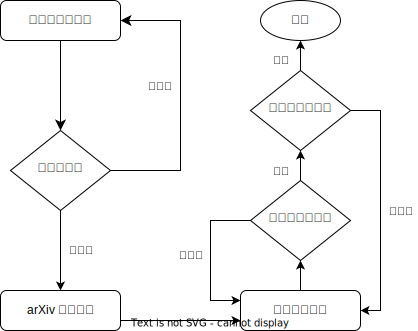

## 从例子开始：寻找一篇为大模型设计专用编程语言的文章

我将该问题翻译为：

```
Can you find me some papers about designing a new programming language for LLM model?
```

### Perplexity.ai 的表现

Perplexity.ai 是 AI 搜索行业的龙头企业之一，其搜索服务分为普通模式和 Pro 模式，其中 Pro 模式更强大，但限制了免费体验的次数。

下面是普通模式的表现：

```
Unfortunately...
```

嗯，先帝创业未半而骈死于槽枥之间了。看看后面说了什么：

```
Unfortunately, I could not find any papers specifically about designing a new programming language for LLM models in the given search results.

... However, the search results do provide some relevant information that could be useful for designing a programming language for LLMs:

1. The paper "Low-code LLM: Graphical User Interface over Large Language Models" [4] introduces a framework for interacting with LLMs through a graphical user interface and low-code visual programming. This could potentially be extended or adapted to design a programming language for LLMs...
```

全回答中只有低代码论文勉强和「代码」和「大语言模型」相关，但显然不是给大语言模型用的编程语言。

如果使用 Pro 模式，则会得到：

```
The query you've posed about finding papers on designing new programming languages for Large Language Models (LLMs) is addressed by two significant contributions in the field:

1. **"Prompting Is Programming: A Query Language for Large Language Models"** - This paper introduces the concept of Language Model Programming (LMP), which extends the idea of prompting LLMs with a combination of text prompts and scripting...

2. **"Efficiently Programming Large Language Models using SGLang"** - This paper presents SGLang, a domain-specific language tailored for programming LLMs...
```

这里得到了两篇真正相关的论文，一篇是设计提示词的编程语言 LMP，一篇是编排大模型的 SGLang，效果比基础版好一些。

注意到 Pro 模式的步骤中有一步是谷歌搜索 `site:arxiv.org programming language for large language models`，搜索得到的前两个结果正是回答中推荐的两篇文章。但 Pro 模式亦止步于此。

### 我的 AI 助理的表现

我的 [本地搜索助理](https://github.com/info-gap/info-gap-server)（怎么没人 Star 呢？）用 1 小时得到了 18 篇可能相关的文章，其中多数文章也并不符合要求，但得到的部分文章比传统 AI 搜索更符合需求。下面的文章推荐按照生成时间排序，最先生成的在最上面：

- CuMo: Scaling Multimodal LLM with Co-Upcycled Mixture-of-Experts
  - 不相关，但大模型把减少计算消耗和新编程语言联系在一起
- Does Fine-Tuning LLMs on New Knowledge Encourage Hallucinations?
  - 不相关，但大模型幻觉出 LLM-Script
- Lumina-T2X: Transforming Text into Any Modality, Resolution, and Duration via Flow-based Large Diffusion Transformers
  - 不相关，但大模型把框架理解为编程语言
- Learned harmonic mean estimation of the Bayesian evidence with normalizing flows
  - 不相关，但这是一篇纯数学文章，LLM 认为这为编程语言奠定基础
- Quantum Communication and Mixed-State Order in Decohered Symmetry-Protected Topological States
  - 不相关，但大模型认为这为硬件实现提供基础
- SPML: A DSL for Defending Language Models Against Prompt Attacks
  - 和新编程语言、LLM 同时相关，专用于抵御提示词攻击的编程语言
- Designing LLM Chains by Adapting Techniques from Crowdsourcing Workflows
  - 不相关，LLM 也知道不直接相关，但还是推荐了
- TypeFly: Flying Drones with Large Language Model
  - 和新编程语言、LLM 同时相关，让大模型能控制无人机
- What Algorithms can Transformers Learn? A Study in Length Generalization
  - 和新编程语言、LLM 同时相关，并且大模型可以被解释为在使用这个编程语言
- AutoScrum: Automating Project Planning Using Large Language Models
  - 不相关，但大模型幻觉出 LLM-Script
- Prompting Is Programming: A Query Language for Large Language Models
  - 和新编程语言、LLM 同时相关，前面 Perplexity.ai 推荐过
- Efficient LLM Comparative Assessment: a Product of Experts Framework for Pairwise Comparisons
  - 不相关，但大模型幻觉出 LLM-Script
- A Survey on Visualization Approaches in Political Science for Social and Political Factors: Progress to Date and Future Opportunities
  - 不相关，LLM 没说相关，但还是推荐了
- A Controlled Experiment on the Energy Efficiency of the Source Code Generated by Code Llama
  - 不相关，但大模型幻觉出 LLM-Script
- Large Language Models Synergize with Automated Machine Learning
  - 不相关，但大模型幻觉出 LlamaScript
- Generating Situated Reflection Triggers about Alternative Solution Paths: A Case Study of Generative AI for Computer-Supported Collaborative Learning
  - 不相关，但这是一篇辅助思考的文章，LLM 认为这可以辅助构思新编程语言
- AI Coders Are Among Us: Rethinking Programming Language Grammar Towards Efficient Code Generation
  - 和新编程语言、LLM 同时相关，是对原有编程语言适配大模型的改良
- Evaluating LLMs for Hardware Design and Test
  - 不相关，但里面涉及 HDL（硬件设计语言）使得大模型认为相关

虽然大部分文章都不相关，但找到的相关文章也更多！要知道在「信息检索」的场景下，得到一些无关信息是无伤大雅的，但漏掉真正相关的信息则是大问题！

同时你会注意到，其实很多无关信息大模型本完全可以筛选掉，比如那些幻觉。**但是！** 我其实是做了筛选的，而且事实上有 90% 左右的无关文章会被筛掉，但有关文章被筛掉的概率几乎为 0。剩下的文章以无关文章为主，是因为关键词检索出来的无关文章太多了……

你可能注意到 SGLang 没有被推荐，这是因为我还没实现分页查询的功能（昨天才开始写这玩意的代码……），所以比较早的文章不会被查询到。这个问题会在后面被讨论。

你可能会发现，几篇相关的文章几乎是连在一起出现的，这是因为对于同一个「检索词想法」搜索到的论文会被放在一起被判断。好的检索词想法更容易带来相关的文章。

## 我是怎么做到的？



### 通过头脑风暴产生搜索关键字

这个节点会源源不断地产生新的搜索想法。怎么确保产生的想法都是新的？

我在实践中发现，如果把已经生成过的关键字放到提示词里面，反而会让大模型倾向于重复已有的内容。只需把模型温度设置为 1，并在提示词中引导「要有创意」，便能获得足够多样的关键字。

### 关键字校验

我使用了 [Instructor](https://python.useinstructor.com/) 库来进行校验。正常而言，大语言模型可以被抽象为一个输入问题文本、输出答案文本的函数，但在现在的场景下我们希望大语言模型产生经过校验的数据。

直接检验输出的答案会存在一个问题：大模型的输出可能包含例如「好问题！我认为……」的前缀，或者「这是因为……」的后缀。这些前后缀可以让语言更通顺，但它们显然不构成搜索关键字的一部分。要剔除这些无关部分并不容易：即使让模型只输出答案，较弱的模型可能依然会输出多余的内容。

Instructor 库使用了「类型即限制」的思想，允许用户使用 [Pydantic](https://docs.pydantic.dev/latest/) 中的类型来限制大模型的回答，甚至可以加上一些用自然语言描述的校验。自然语言校验也会由大模型来进行，这里就用到了多智能体的思想。

有了 Instructor 库，我只需要为搜索关键字加上「必须符合……格式」的自然语言校验，就能源源不断地获得合理的搜索关键字。

